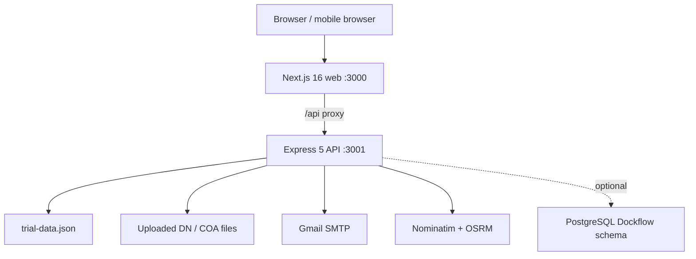
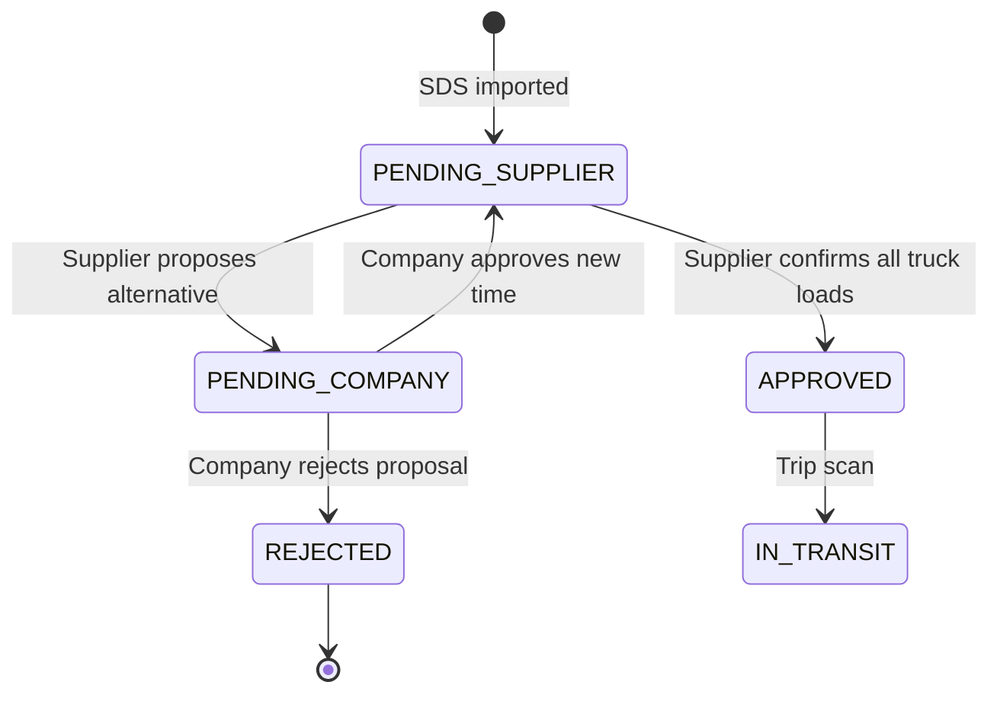

# DockFlow Senior Developer Handoff

**System:** DockFlow Delivery Scheduling  
**Build:** Trial JSON edition, application version 0.1.0  
**Report date:** 2026-08-31  
**Operational timezone:** Asia/Manila (GMT+8)

## 1. Executive summary

DockFlow coordinates proposed delivery schedules from an SDS spreadsheet, supplier responses, company schedule decisions, truck confirmation, QR-based handoffs, ETA display, history, and supplier performance reports.

The current package is deliberately configured as a **single-instance trial**:

- Business data is stored in `data/trial-data.json`.
- PostgreSQL is disabled by Docker Compose (`DB_ENABLED=false`).
- Email uses a private SMTP account configured only in `.env`.
- ETA uses external OpenStreetMap Nominatim and OSRM endpoints unless replaced with internal services.
- The browser talks to the Next.js server, which proxies `/api/*` to the Express API. The API container is not published directly by Docker Compose.

The most important scheduling rule is now:

1. Planner or Administrator imports an SDS proposal.
2. The supplier accepts it or proposes one alternative date/time with a reason.
3. If an alternative is proposed, Planner, Production, or Administrator reviews it.
4. Company approval applies the new time and asks the supplier to confirm truck/driver details.
5. Company rejection closes the proposal and gives the supplier the reason.
6. Both company outcomes create an in-app notification and attempt an email to the supplier.
7. A QR code and report entry are created only after all materials are assigned to confirmed trucks.

## 2. System architecture



| Layer | Main files | Responsibility |
|---|---|---|
| Web application | `app/dockflow-app.tsx`, `app/dockflow-features.tsx`, `app/globals.css` | Role-specific pages, forms, calendar, notifications, scanning, reports, modals |
| API client | `app/api-client.ts` | Request IDs, bearer token, refresh-token retry, API errors |
| API server | `server/index.js` | Authentication, authorization, imports, decisions, scans, ETA, email, exports |
| Spreadsheet parser | `server/excel-import.js` | Reads Excel/OpenDocument/delimited files and normalizes SDS fields |
| Email service | `server/mailer.js` | Verification, supplier-specific SDS changes, supplier/company decisions |
| Trial store | `server/json-store.js` | Serialized reads, queued updates, atomic temporary-file rename |
| Optional database | `server/db.js` | Refresh tokens, summarized API activity, and trial records when enabled |
| Reverse proxy | `next.config.ts` | Sends browser `/api/*` requests to `API_INTERNAL_URL` |
| Containers | `Dockerfile`, `docker-compose.yml` | Separate production web and API containers |

## 3. User roles and access

| Role | Main screens | Data scope | Write actions |
|---|---|---|---|
| Administrator | Overview, Monitoring, Schedule, Scan, History, Reports, Administration | All suppliers | Import SDS, review alternatives, manage accounts/catalogs/routes, all scan stations |
| Planner | Overview, Monitoring, Schedule, History, Reports | All suppliers | Import SDS, resolve import conflicts, review supplier alternatives |
| Production | Overview, Monitoring, Schedule, History, Reports | All suppliers | Review supplier alternative schedules; cannot upload schedules or edit availability |
| Supplier | Schedule, My entries, Scan, History, Reports | Its linked supplier only | Accept schedule, propose alternative, confirm truck loads, scan Trip, verify own email |
| Driver | Monitoring, Schedule, Scan, History, Reports | Its linked supplier only | Read-only; can view its company’s approved QR entries |
| Security | Monitoring, Schedule, Scan | All active deliveries | Scan Gate in and Gate out |
| Warehouse | Monitoring, Schedule, Scan | All active deliveries | Scan Unloading and Received |

Authorization is enforced twice:

- The React application hides screens and controls that do not belong to the role.
- The Express API independently checks the JWT role and supplier ownership. Hiding a button is not treated as security.

## 4. Functional requirements implemented

### 4.1 Accounts and supplier ownership

- Administrator creates accounts with name, username, email, role, and an eight-character minimum password.
- A supplier account creates or links its own supplier company; the form does not ask for a redundant supplier-company selection.
- A driver must be linked to an existing supplier company.
- One active supplier account is allowed per supplier company.
- Deleting an account requires the current administrator’s password.
- Account deletion revokes refresh tokens and keeps supplier/delivery/history records.
- Suppliers and drivers receive only their own supplier’s shipments in `/api/bootstrap`.

### 4.2 Email verification

- The sender mailbox and Google App Password are server-side `.env` values.
- An administrator or the account owner can set the recipient email.
- A six-digit verification code is hashed before storage, expires after ten minutes, and permits five incorrect attempts.
- Only verified recipients are used for operational emails.
- SMTP credentials are never returned by the API, saved to JSON, or displayed in the browser.

### 4.3 SDS import and comparison

- Accepted extensions: `.xlsx`, `.xlsm`, `.xls`, `.xlsb`, `.xltx`, `.xltm`, `.ods`, `.csv`, and `.tsv`.
- Maximum spreadsheet upload size: 25 MB.
- Primary operational columns: Week, Site, Supplier, Material Code, UOM, Quantity, Date, and Time.
- Missing non-key values are replaced by parser-safe placeholders so useful rows are not discarded.
- Every supplier in an import must have a linked supplier account.
- Identical proposal fingerprints remain unchanged.
- A changed pending proposal becomes a visible conflict. The user chooses **Keep existing** or **Update from upload**.
- Confirmed/completed deliveries are retained instead of being silently overwritten.
- Each verified supplier receives only its own new/rescheduled proposal details. Reschedules show Before and After values.
- Material descriptions, source sheet names, source row numbers, and source filenames are removed from supplier-facing API objects.

### 4.4 Supplier response and company decision



Supplier response behavior:

- The supplier can accept the SDS time or propose an alternative.
- An alternative requires a reason, date, start time, and later end time.
- The proposal shows the original schedule, proposed schedule, and supplier reason to company reviewers.
- Administrator, Planner, and Production can approve or reject the alternative.
- Company rejection requires a reason.
- Approval replaces the schedule with the alternative and returns the proposal to the supplier for truck/driver confirmation.
- Rejection marks the proposal rejected and preserves the reason in History.
- The supplier receives an in-app notification immediately in the JSON state and sees it on the next data poll (maximum normal delay: about 30 seconds).
- The system also attempts an email to every verified supplier account linked to that company.

### 4.5 Truck and material confirmation

- A supplier confirms one truck at a time.
- Required values: unique truck plate, driver name, valid international phone number, and at least one material code.
- Phone format is E.164-like: `+` followed by 8–15 digits. The UI supplies country-code choices and numeric local input.
- A material code can be assigned to only one truck for the proposal.
- Multiple trucks are supported by returning for the remaining codes.
- Every confirmed truck receives a unique delivery code.
- The proposal becomes `APPROVED/BOOKED` only when every material code has a truck.
- QR, downloadable booking PDF, Monitoring card, and report eligibility start after full confirmation.

### 4.6 Scheduling calendar

- Day and week views are available.
- The calendar shows a compact, scrollable 24-hour day.
- Imported schedules create a one-hour display window when no matching window exists.
- Pending supplier proposals and pending company reviews are visually distinct from approved deliveries.
- Approved deliveries cover the available window beneath them.
- Manual drag/resizing is intentionally disabled in the current trial; the SDS remains the scheduling source of truth.

### 4.7 QR movement workflow

| Step | State | Authorized role | Effect |
|---|---|---|---|
| Booking | `BOOKED` | Supplier confirmation | QR becomes available |
| Trip | `IN_TRANSIT` | Supplier or Administrator | Records Trip timestamp and calculates ETA |
| Gate in | `GATE_IN` | Security or Administrator | Records site arrival |
| Unloading | `UNLOADING` | Warehouse or Administrator | Starts unloading duration |
| Received | `RECEIVED` | Warehouse or Administrator | Records receiving completion |
| Gate out | `GATE_OUT` | Security or Administrator | Records exit and total site time |

The API rejects skipped stages, wrong-role scans, another supplier’s shipment, and any unapproved booking. Repeated scans of the same completed stage are idempotent and return an “already recorded” response.

### 4.8 ETA

- Administrator saves the receiving-site address and each supplier’s dispatch address.
- Nominatim converts the addresses to coordinates.
- OSRM estimates road distance and travel time without traffic.
- The route is saved per supplier.
- Trip scan adds the route duration to the scan timestamp and displays estimated arrival in Monitoring.
- All displayed operational timestamps use Asia/Manila.

### 4.9 Monitoring, history, and reports

- Monitoring includes approved active deliveries only and sorts by process progress, then schedule.
- A two-click calendar selects a date range; See All clears it.
- History holds previous/completed/rejected records and supports company filters.
- Supplier/driver history is supplier-scoped and removes irrelevant company-wide filter controls.
- Reports include approved, non-rejected deliveries only.
- The Excel report contains styled Summary, Deliveries, and Material Codes sheets.
- Company roles can filter suppliers; supplier and driver exports are forced to their linked company.
- Booking PDF is one compact page and includes a complete, uncropped QR.

## 5. Non-functional requirements and controls

| Area | Current implementation | What it means |
|---|---|---|
| Security | JWT access tokens, rotating refresh tokens, hashed passwords, role checks, supplier scoping, Helmet, CORS, rate limits | Common unauthenticated and cross-role access attempts are rejected server-side |
| Privacy | Supplier-safe response mapping; SMTP secrets kept in `.env`; refresh tokens stored as SHA-256 hashes | Supplier users do not receive descriptions/internal import metadata or reusable secrets |
| Reliability | Queued JSON writes and atomic rename; idempotent import comparison; duplicate material/truck checks | Concurrent updates in one API process do not overwrite one another; repeated imports do not spam records |
| Performance | Static Next.js production build; compact bootstrap; 30-second notification polling; session-level DB log summaries | Appropriate for a small single-instance trial, not yet a high-volume platform |
| Usability | Responsive desktop/mobile CSS, full-page modals, role-specific navigation, light/dark modes | Core tasks work on desktop and mobile-sized screens |
| Maintainability | TypeScript UI types, isolated parser/mailer/store modules, automated end-to-end workflow test | Main integration behavior can be regression-tested before handoff |
| Observability | `X-Request-ID`, safe error messages with request ID, optional summarized PostgreSQL API activity | A failing browser call can be matched to a server request without storing every request row |
| Data integrity | Server validation, import identity/fingerprint, unique truck assignment, ordered scan transitions | The browser cannot bypass workflow rules with a handcrafted request |
| Portability | npm scripts and multi-stage Docker build; environment-driven URLs/secrets | Runs locally, on a LAN, or behind a deployment proxy with configuration changes |
| Accessibility | Semantic buttons/labels, keyboard-close modals, visible focus-compatible controls | Basic accessible operation is present; a formal WCAG audit has not been completed |

## 6. Authentication and security details

### Tokens

- Access token default lifetime: 15 minutes.
- Refresh token default lifetime: 7 days.
- Access token travels in `Authorization: Bearer …`.
- Refresh token is an HttpOnly, SameSite=Strict cookie restricted to `/api/auth`.
- Refresh rotation revokes the old token and issues a new refresh token.
- Browser API calls retry once after a `401` by refreshing the access token.
- When PostgreSQL is disabled, refresh-token records are in memory and all sessions are invalidated by an API restart.

### Rate limits

| Limit | Default | Behavior after limit |
|---|---:|---|
| All `/api` requests | 300 per IP per 60 seconds | HTTP 429 until the window resets |
| Failed logins | 10 per IP per 15 minutes | HTTP 429; successful logins do not consume the failure limit |
| Refresh endpoint | 30 per IP per 15 minutes | HTTP 429 for refresh calls only; it does not ban login or the entire IP |

Rate limiting is an in-process memory control. Multiple API replicas would each have separate counters unless a shared store such as Redis is added.

### CORS

- Exact origins come from `APP_ORIGIN` and `CORS_ORIGINS`.
- LAN development can allow localhost and private IPv4 origins when `ALLOW_PRIVATE_NETWORK_ORIGINS=true`.
- Unknown public origins receive HTTP 403.
- Credentials are allowed so the browser can send the HttpOnly refresh cookie.
- Production should set explicit HTTPS origins and turn private-origin wildcard behavior off.

### Passwords, input, and uploads

- Passwords use bcrypt with cost 10.
- Account creation requires at least eight characters; stronger production policy and MFA are not yet implemented.
- JSON bodies are limited to 2 MB.
- Spreadsheet uploads use memory storage, extension allowlisting, one file, and a 25 MB limit.
- DN/COA uploads use disk storage, MIME allowlisting, and a 15 MB limit.
- Material-code catalog input is restricted to letters, numbers, dots, slashes, underscores, and hyphens.
- All API errors include a request ID; server errors do not return SMTP credentials or stack traces.

## 7. Data model

### Primary JSON collections

| Collection | Purpose |
|---|---|
| `users` | Login identity, bcrypt hash, role, supplier link, verified email state |
| `suppliers` | Supplier company, vendor code, allowed material codes, ETA route |
| `shipments` | Proposal/booking, schedule, truck/driver, statuses, scan timestamps, items |
| `notifications` | Per-user in-app alerts with read timestamp and shipment link |
| `importBatches` | Import totals and email-delivery summary |
| `audit` | Business actions such as import, response, decision, confirmation, scan |
| `settings` | Site information, two-dock setting, schedule windows, delivery-code sequence |

### Important shipment fields

| Group | Fields |
|---|---|
| Identity | `id`, `shipmentNumber`, `bookingReceipt`, `deliveryCode` |
| Ownership | `supplier`, `supplierId`, `vendorCode` |
| Schedule | `scheduledDate`, `scheduledTime`, `scheduledEndTime`, `availabilitySlotId` |
| Booking workflow | `bookingStatus`, `supplierResponse`, `supplierResponseReason`, `alternative*`, `companyDecision*` |
| Vehicle | `truckPlate`, `driverName`, `driverPhone`, `confirmedTruckLoads` |
| Operations | `status`, `tripAt`, `gateInAt`, `unloadingAt`, `receivedAt`, `gateOutAt` |
| ETA | `estimatedTravelMinutes`, `estimatedTravelDistanceKm`, `estimatedArrivalAt` |
| Materials | `items[]` with code, quantity, UOM, site, week, supplier approval, truck assignment |
| Import safety | `sdsImportIdentity`, `sdsImportFingerprint`, `importBatchId` |

### Optional PostgreSQL schema

If `DB_ENABLED=true`, `server/db.js` creates the quoted schema named by `DB_SCHEMA`/`PGSCHEMA` (default `Dockflow`) and these tables:

- `refresh_tokens`: hashed, revocable refresh-token records.
- `api_request_logs`: summarized activity by session or anonymous daily fingerprint.
- `trial_records`: manual trial/connection records.

PostgreSQL is **not** the business-data store in this build. Deliveries, users, suppliers, notifications, and settings remain in JSON even when PostgreSQL is enabled.

## 8. API catalog

| Method and route | Main role(s) | Purpose |
|---|---|---|
| `GET /api/health` | Public | API and optional DB health |
| `POST /api/auth/login` | Public | Authenticate and issue access/refresh tokens |
| `POST /api/auth/refresh` | Cookie session | Rotate refresh token and issue access token |
| `POST /api/auth/logout` | Session | Revoke refresh token and clear cookie |
| `GET /api/bootstrap` | Authenticated | Role-scoped application state |
| `PATCH /api/notifications/:id/read` | Notification owner | Mark in-app alert read |
| `POST /api/imports/excel/preview` | Admin, Planner | Parse file, validate accounts, identify conflicts |
| `POST /api/imports/excel/commit` | Admin, Planner | Apply reviewed import and email suppliers |
| `PATCH /api/shipments/:id/supplier-response` | Owning Supplier | Accept truck load or propose alternative |
| `PATCH /api/shipments/:id/company-decision` | Admin, Planner, Production | Approve/reject supplier alternative |
| `POST /api/shipments/scan-stage` | Stage-specific roles | Record QR process stage |
| `PATCH /api/shipments/:id/status` | Restricted roles | Compatibility/manual status update |
| `GET /api/shipments/:id/qr.svg` | Authorized shipment viewer | Protected QR image |
| `GET /api/shipments/:id/booking.pdf` | Authorized shipment viewer | Protected booking receipt |
| `PATCH /api/settings/site-address` | Administrator | Geocode receiving address |
| `PATCH /api/suppliers/:id/route` | Administrator | Geocode supplier and calculate route |
| `PATCH /api/suppliers/:id/presets` | Administrator | Save allowed material-code catalog |
| `POST /api/users` | Administrator | Create account |
| `DELETE /api/users/:id` | Administrator + password | Delete account, retain records |
| `PATCH /api/users/:id/email` | Admin or same account | Set unverified email |
| `POST /api/users/:id/email/send-code` | Admin or same account | Send verification code |
| `POST /api/users/:id/email/verify` | Admin or same account | Verify code |
| `GET /api/reports/export.xlsx` | Report roles | Download scoped styled report |
| `POST /api/shipment-items/:id/documents` | Admin, owning Supplier | Upload DN or COA |
| `/api/rds`, `POST /api/shipments` | Authenticated | Returns 410; old manual-request workflow removed |

Legacy availability and manual schedule endpoints remain in the API for compatibility, but the current Schedule UI is read-only and SDS-driven.

## 9. Environment configuration

### Required before any real deployment

```env
JWT_SECRET=<long random secret>
ACCESS_TOKEN_SECRET=<different long random secret>
REFRESH_TOKEN_SECRET=<different long random secret>
APP_ORIGIN=https://dockflow.example.com
CORS_ORIGINS=https://dockflow.example.com
ALLOW_PRIVATE_NETWORK_ORIGINS=false
COOKIE_SECURE=true
TZ=Asia/Manila
```

Generate secrets with a password manager or a cryptographic command; do not reuse the example values.

### Email

```env
EMAIL_NOTIFICATIONS_ENABLED=true
SMTP_HOST=smtp.gmail.com
SMTP_PORT=465
SMTP_SECURE=true
SMTP_USER=<dedicated Gmail address>
SMTP_APP_PASSWORD=<Google App Password, not normal password>
MAIL_FROM=
```

### ETA

```env
GEOCODING_API_URL=https://nominatim.openstreetmap.org/search
ROUTING_API_URL=https://router.project-osrm.org/route/v1/driving
ETA_USER_AGENT=DockFlow/0.1 (operations-contact@example.com)
ETA_API_TIMEOUT_MS=10000
```

Public ETA and Gmail require outbound internet. For an offline site, point these variables to internal providers or accept that those two functions are unavailable.

## 10. Deployment

### Docker trial deployment

```powershell
Copy-Item .env.example .env
# Edit .env before continuing.
docker compose up --build -d
docker compose ps
docker compose logs -f api web
```

Open `http://localhost:5059`. For another device on the same LAN, use the host PC’s LAN IP and ensure the firewall allows port 5059.

Stop without deleting data:

```powershell
docker compose down
```

Rebuild after code changes:

```powershell
docker compose up --build -d
```

The `./data` bind mount retains trial JSON. `dockflow_uploads` retains uploaded documents. Back both up before replacing or moving the deployment.

### npm development

```powershell
Copy-Item .env.example .env
npm.cmd install
npm.cmd run dev
```

Web: `http://127.0.0.1:3000`  
API: `http://127.0.0.1:3001`

## 11. Verification plan for the senior developer

Run the automated suite first:

```powershell
npm.cmd test
```

It currently verifies:

- Spreadsheet parsing across supported formats and missing values.
- Exact/random schedule times and repeated-looking material rows.
- Supplier-specific Before/After email content.
- CORS allowed/blocked origins.
- Authentication and refresh-token rotation.
- Role and supplier data scoping.
- Account email verification.
- Import deduplication and conflict resolution.
- Multi-truck supplier confirmation.
- Company approval and rejection of supplier alternatives.
- Supplier in-app decision notifications.
- Protected QR and one-page PDF.
- ETA route calculation at Trip scan.
- Ordered Trip → Gate in → Unloading → Received → Gate out scans.
- Styled Excel report generation.
- Production build and TypeScript compilation.

Manual acceptance demo:

1. Sign in as Administrator and confirm the supplier account email is verified.
2. Import a small SDS with one known supplier and one material code.
3. Sign in as that Supplier and propose a different time with a reason.
4. Sign in as Production or Planner. Open Schedule → Alternative schedules to review.
5. Approve it. Confirm that the supplier receives an app notification and email.
6. Sign in as Supplier, confirm the new time with truck, driver, phone, and material code.
7. Confirm QR/PDF/Monitoring/report availability.
8. Repeat with another proposal and reject the alternative with a company reason.
9. Confirm the supplier’s app and email both show the rejection reason.
10. Scan the accepted delivery through all five physical stages and inspect timers/History.

Security smoke tests should verify HTTP 401 without a bearer token, HTTP 403 for a wrong role/origin, and HTTP 429 after rate-limit thresholds. Use a non-production test environment because rate-limit tests intentionally generate many requests.

## 12. Known limitations and recommended production work

1. **JSON is single-instance trial storage.** It does not support multiple API replicas, database transactions across services, or database-level reporting. Move business entities to PostgreSQL before horizontal scaling.
2. **Refresh sessions reset when DB is disabled.** An API restart signs everyone out. Enable PostgreSQL or another shared session store for production.
3. **Notifications use polling.** The UI refreshes state every 30 seconds. Use WebSocket or Server-Sent Events if sub-second push is required.
4. **Rate limits are per API process.** Use a shared Redis-backed limiter behind multiple replicas.
5. **Email delivery is best effort.** Business state is committed even if SMTP fails. A durable job/outbox queue with retry and admin delivery status is recommended.
6. **ETA has no traffic.** Public Nominatim/OSRM are unsuitable for guaranteed commercial SLA without reviewing provider policies. Use a contracted or internally hosted service.
7. **No MFA or password reset.** Add MFA, password rotation/reset, account lockout policy, and privileged-action reauthentication for production.
8. **No formal malware scanning.** Uploaded DN/COA files are allowlisted by MIME and size but should be scanned and stored in private object storage.
9. **No formal accessibility or penetration audit.** Automated tests prove expected application behavior, not the absence of every vulnerability.
10. **Availability/manual schedule endpoints are legacy.** Remove them after confirming no external consumer depends on them.
11. **Trial credentials are seeded.** Change or remove every default account before exposure outside a controlled environment.
12. **Use HTTPS.** Set secure cookies and terminate TLS at a trusted reverse proxy before an internet deployment such as DigitalOcean.

## 13. Short explanation for a senior review

> DockFlow is an SDS-driven delivery workflow. Imports create supplier proposals, never immediate bookings. The supplier either confirms truck loads or proposes an alternative with a reason. A company reviewer approves or rejects that alternative; the supplier receives both an in-app alert and verified-email notification. Only complete truck/material confirmation produces the protected QR, report entry, and operational scan journey. The API—not the UI—enforces roles, supplier ownership, workflow order, validation, CORS, and rate limits. This trial uses atomic JSON storage, while PostgreSQL remains optional for sessions and summarized telemetry. The next production milestone is migrating business data and background email work to shared durable infrastructure.

